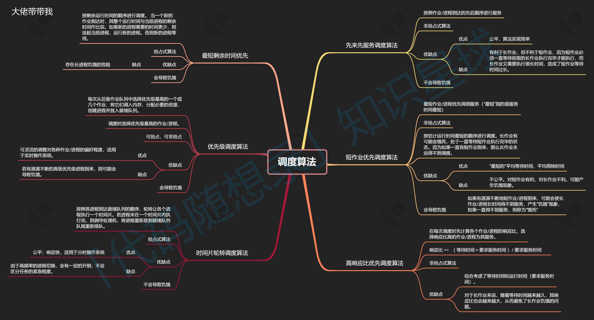

# 1.操作系统基础
这份选定内容主要介绍了**操作系统的定义、特征、功能及其核心角色**。以下是该内容的要点概括：

## 1. 操作系统的定义

* **本质**：介于硬件资源与应用程序之间的**系统软件**。
* **核心作用**：管理计算机软硬件资源，调度工作与分配资源，为用户及软件提供接口与服务。
* **直观理解**：它是“掌控计算机的系统”，是计算机最基本的底座。

---

## 2. 操作系统的四大特征

* **并发**：多个事件在同一时间间隔内发生（区别于“并行”：同一时刻发生）。
* **共享**：资源供多个进程共同使用，分为**互斥共享**（如临界资源）和**同时访问**（宏观同时，微观交替）。
* **虚拟**：通过技术手段将一个物理实体映射为多个逻辑对应物。
* **异步**：进程以不可预知的速度向前推进，执行过程并非一贯到底。

---

## 3. 操作系统的核心功能与内核能力

* **资源管理**：对CPU、内存、硬盘、I/O设备进行有效的**分配与回收**，处理进程调度、内存碎片等问题。
* **提供服务**：封装硬件操作，通过**系统调用**（System Call）为开发者提供统一接口，保护硬件不被非法操作损坏。
* **管理应用**：控制进程的完整生命周期（环境配置、资源分配、监控及回收）。
* **内核四大能力**：进程调度、内存管理、硬件通信、系统调用。

---

## 4. 操作系统的角色定位

* **管理者**：负责CPU、内存、外存、I/O的管理，并确保系统的健壮性（鲁棒性）与安全性。
* **魔术师**：通过虚拟化技术，让每个进程产生“独占CPU”和“独占整片内存”的错觉。

---

## 5. 用户程序与OS的关系

* **双向交互**：操作系统是进程的运行环境与监控者；进程则是操作系统的服务调用者。

请问您是否需要我为您对比一下“并发”与“并行”在底层实现上的具体差异？

# 2.进程线程，并行并发
根据您选中的内容，这份笔记详细介绍了操作系统中**进程、线程、调度及通信**的核心面试知识点。以下是为您整理的简要概括：

## 1. 进程与线程的基础

* **核心定义**：进程是**资源分配**的最小单位；线程是**程序执行**的最小单位。
* **主要区别**：
* **资源**：进程拥有独立内存空间，开销大；线程共享进程内的内存空间，创建/销毁开销小。
* **通信**：进程间通信（IPC）需特殊机制；线程间可直接访问共享数据，更便捷。
* **安全性**：进程间相互隔离，单进程崩溃不影响其他；一个线程崩溃可能导致整个进程崩溃。

---

## 2. 运行模式与执行概念

* **用户态 vs 核心态**：
* **用户态**：低权限，运行普通程序，无法直接访问硬件。
* **核心态**：高权限，运行内核代码，管理系统资源。通过**系统调用**进行切换。


* **并行 vs 并发**：
* **并行**：同一时刻多个任务同时进行（多核驱动）。
* **并发**：一段时间内交替执行多个任务（通过时间片切换实现）。

简单来说，**并行（Parallelism）**是“手多”，**并发（Concurrency）**是“手快”。我们可以通过几个生活中的形象例子来区分它们：


### 咖啡店排队（最经典的例子）

* **并发 (Concurrency)**：
**只有一台咖啡机和一个店员。** 店员先给 A 点单，等咖啡机磨豆的时候，转身给 B 点单。虽然 A 和 B 的需求都在处理中，但店员在同一时刻只能服务一个人。这叫“同时处理多个任务的能力”，依靠的是**快速切换**。
* **并行 (Parallelism)**：
**有两台咖啡机和两个店员。** 两个店员各自服务一名顾客，两杯咖啡在同一时刻被制作出来。这叫“同时执行多个任务”，依靠的是**增加资源**（增加核心数）。


### 核心区别总结

| 特性 | 并发 (Concurrency) | 并行 (Parallelism) |
| --- | --- | --- |
| **本质** | 逻辑上的同时发生（看似同时） | 物理上的同时发生（真正同时） |
| **资源** | 通常指在单个 CPU 上通过时间片切换 | 需要多个 CPU 或多核处理器 |
| **关注点** | 任务切换，解决“拥塞” | 任务分工，解决“速度” |

**简单记法：**

* **并发**：是一个人在多个任务之间快速“反复横跳”。
* **并行**：是多个人同时各干各的。

### Go语言中处理并发并行：Goroutine（协程）和G-P-M模型
**逻辑上的并发:Goroutine**:
在Go中，只需要一个关键字go就能开启并发。协程是用户态的轻量级线程，开启一个协程仅需几kb的内存
* 实现方式：
```go
func main() {
    go taskA() // 开启协程A
    go taskB() // 开启协程B
    // 主线程继续执行
}

```
* 并发体现：即使是在单核CPU上，Go运行时（Runtime）也会通过调度器让taskA和taskB交替执行。由于切换极快，逻辑上它们是"同时“运行的。

**物理上的并行：G-P-M模型**
Go能够真正利用多核CPU的优势实现并行，这归功于它的调度模型：
* G（Goroutine）：你开启的协程
* P（Processer）：逻辑处理器，掌握着运行协程所需的资源和上下文
* M（Machine):实际的操作系统线程（内核线程）
* 如何实现并行：当你的电脑有多个核心时，Go会创建多个P。每个P都会绑定一个内核线程M
  * 核心1上的M1正在运行Goroutine1
  * 核心2上的M2正在运行Goroutine2 这时，这两个任务在物理上是绝对同时进行的，这就是并行

**控制并发与并行的“开关”**
Go允许你通过代码控制程序能利用多少个物理核心:
* runtime.GOMAXPROCS(n):
   * 如果n>1:程序可以分配到多个核心上运行，实现并行。
   * 如果n=1:所有协程都在一个物理核心上轮换，只能实现并发
   * 不设置的话，默认值是机器的CPU核心数

**协作与通信:Channel(通道)**
为了让并发和并行的任务能够安全交换数据，Go提供了Channel
* 并发同步：当一个协程在等待Channel的数据时，它会被阻塞，Go调度器会自动把CPU资源切给其他协程，确保不浪费计算能力


---

## 3. 进程管理与状态转换

* **进程状态**：包括新建、就绪、运行、阻塞和结束。状态转换主要受调度、时间片耗尽或I/O请求驱动。
* **异常进程**：
* **孤儿进程**：父进程先退出，由`init`进程领养。
* **僵尸进程**：子进程已终止但父进程未回收状态，占用系统表项。


* **调度层次**：**作业调度**（决定谁进入内存）是**进程调度**（决定谁占用CPU）的前提。

## 4. 核心算法与机制


* **调度算法**：
* **基础类**：先来先服务（FCFS）、短作业优先（SJF）、最短剩余时间优先（SRTF）。
* **交互类**：时间片轮转（RR）、高响应比、优先级调度。
* **综合类**：多级反馈队列（MLFQ），兼顾公平与效率。
<br><br>

* **进程间通信方式（IPC）**：管道（匿名/命名）、消息队列、共享内存、信号量（互斥同步）、信号（异步通知）、Socket（跨主机）。<br><br>
  

* **中断与异常**：
* **中断（外部）**：与当前指令无关的异步事件（如键盘输入）。中断提供了外设与CPU交流的机制，它也是一种重要的I/O方式
* **异常（内部）**：执行指令时产生的同步事件（如除零、故障），与CPU正在执行的指令密切相关。
* **中断机制**：CPU接收到中断请求，在当前指令结束时CPU进入中断周期进行中断响应，并在中断响应中引入中断服务程序，由中断服务程序执行后续的中断处理


---

# 4.互斥与同步
---

## 模块一：进程同步与互斥 (核心基础)

**1. 核心概念对比：**
*   **互斥 (Mutual Exclusion)**：**“你用我就不能用”**。针对竞争关系，保证同一时刻只有一个进程访问临界资源（如打印机、共享变量）。
*   **同步 (Synchronization)**：**“你做完我才能做”**。针对协作关系，协调进程间的执行顺序（如先生产、后消费）。

**2. 临界区管理准则 (软考常考)：**
*   空闲让进、忙则等待、有限等待、让权等待。

**3. 实现机制：**
*   **锁 (Lock/Mutex)**：简单互斥。
*   **信号量 (Semaphore)**：通过 PV 操作实现。
*   **管程 (Monitor)**：一种高级同步机制，特点是**封装性**，将共享资源和操作封装在一起，自动实现互斥。

---

## 模块二：PV 操作 (计算与逻辑大题常客)

这是软考中下午题或上午选择题的高频考点。

**1. 基本定义：**
*   **P 操作 (wait)**：申请资源。`S = S - 1`。若 `S < 0`，进程阻塞，进入等待队列。
*   **V 操作 (signal)**：释放资源。`S = S + 1`。若 `S <= 0`，唤醒等待队列中的一个进程。

**2. 信号量 S 的含义：**
*   `S > 0`：表示当前可用资源的数量。
*   `S = 0`：资源恰好用完。
*   `S < 0`：其绝对值 `|S|` 表示当前正在等待该资源的进程数量。

**3. 经典问题模型：**
*   **生产者-消费者**：涉及空位信号量（empty）、产品信号量（full）和互斥信号量（mutex）。
*   **读者-写者**：读读并行，读写互斥，写写互斥。
*   **哲学家进餐**：死锁预防的典型案例。

---

## 模块三：死锁 (理论必考)

**1. 死锁产生的 4 个必要条件 (必须背诵)：**
1.  **互斥条件**：资源独占。
2.  **请求与保持条件**：拿着不放，还要申请。
3.  **不剥夺条件**：不能强行抢夺。
4.  **循环等待条件**：形成闭环。

**2. 死锁处理策略：**
*   **预防 (Prevention)**：破坏 4 个必要条件之一（如资源有序分配法破坏循环等待）。
*   **避免 (Avoidance)**：在分配前判断是否安全（**银行家算法**）。
*   **检测与恢复**：允许死锁发生，发现后通过撤销进程或剥夺资源来解除。

---

## 模块四：银行家算法 (算法逻辑)

这是死锁**避免**的代表性算法。其核心是判断系统是否处于**安全状态**。

**1. 数据结构：**
*   `Max`：最大需求。
*   `Allocation`：已分配。
*   `Need`：还需多少。公式：\[Need = Max - Allocation\]
*   `Available`：系统当前剩余可用资源。

**2. 安全性检查步骤：**
系统尝试寻找一个**安全序列**。如果存在一个序列，使得每个进程在获取资源后都能顺利完成并归还资源，则系统是安全的。

---

## 模块五：各类锁的特性 (面试与选择题)

*   **自旋锁 (Spinlock)**：不阻塞，原地“打转”等待（忙等）。适用于锁持有时间极短的场景。
*   **读写锁**：读共享，写独占。
*   **乐观锁 vs 悲观锁**：
    *   **悲观锁**：先取锁再访问，怕冲突。
    *   **乐观锁**：先访问，提交时检测冲突（如版本号机制）。

---

## 银行家算法详细分析
银行家算法（Banker's Algorithm）是操作系统中**死锁避免**的经典算法。在软考中，它不仅是上午选择题的常客，也经常出现在下午的大题中。

为了让你彻底理解，我们抛开枯燥的定义，用“**借贷经理**”的逻辑来深入浅出地解读。

---

### 一、 核心直觉：为什么叫“银行家”？

想象你是一家银行的经理，手里有 10 万现金（**Available**）。
有三个客户（进程）来贷款，他们每个人都有一个最高贷款额度（**Max**）。

*   **死锁风险**：如果每个客户都借了一半钱，谁也无法完成项目还钱，银行就倒闭了（死锁）。
*   **银行家策略**：当有人申请贷款时，你要先**模拟**一下：*“如果我把钱借给他，手里剩下的钱还能不能让至少一个客户完成项目并还钱？”* 
    *   如果能，就借（安全状态）。
    *   如果借出去后，剩下的钱不足以让任何一个客户结清贷款，你就拒绝申请（不安全状态）。

---

### 二、 必须掌握的“账本” (数据结构)

在软考计算题中，你会看到一个表格，请记住这个公式：
\[Need = Max - Allocation\]

1.  **Max (最大需求)**：进程完成任务总共需要的资源。
2.  **Allocation (已分配)**：进程目前已经拿在手里的资源。
3.  **Need (还需)**：进程还需要多少资源才能运行完。
4.  **Available (可用)**：系统当前剩余、还没分配出去的资源。

---

### 三、 算法的两大步骤

#### 第一步：资源请求检查 (Request Check)
当进程 $P_i$ 发出请求 $Request_i$ 时，系统先做“预审”：
1.  如果 $Request_i > Need_i$，报错（你要的比你当初申请的总额还多，不合法）。
2.  如果 $Request_i > Available$，等待（银行现在没那么多现钱）。
3.  **预分配**：假设借给它，修改账本：
    *   $Available = Available - Request_i$
    *   $Allocation_i = Allocation_i + Request_i$
    *   $Need_i = Need_i - Request_i$

#### 第二步：安全性检查 (Safety Algorithm) —— **灵魂环节**
这是银行家算法最核心的部分。系统要寻找是否存在一个**安全序列**。

**逻辑如下：**
1.  找一个进程 $P_i$，它的 **还需资源 ($Need$) $\le$ 当前可用 ($Available$)**。
2.  如果找到了，假设它执行完成，它会把之前占有的所有资源都还回来：
    *   $Available = Available + Allocation_i$
3.  循环这个过程，看能不能把所有进程都加入这个“完成名单”。
4.  **结论**：如果所有进程都能完成，则系统处于**安全状态**，正式拨款；否则，撤销刚才的预分配，让进程等待。

---

### 四、 实例模拟（软考真题风格）

假设系统有 3 类资源 (A, B, C)，当前 **Available (2, 1, 0)**。

| 进程 | Allocation (已分配) | Need (还需) |
| :--- | :--- | :--- |
| P0 | (1, 1, 0) | (0, 1, 0) |
| P1 | (2, 0, 1) | (1, 0, 1) |
| P2 | (0, 1, 1) | (2, 1, 1) |

**推演过程：**
1.  **看 P0**：$Need(0, 1, 0) \le Available(2, 1, 0)$？**是的**。
    *   P0 完成，释放资源。新 $Available = (2, 1, 0) + (1, 1, 0) = \mathbf{(3, 2, 0)}$。
2.  **看 P1**：$Need(1, 0, 1) \le Available(3, 2, 0)$？**不是**（C类资源不够）。
3.  **看 P2**：$Need(2, 1, 1) \le Available(3, 2, 0)$？**不是**（C类资源不够）。
4.  **结论**：在这个例子中，如果只有 P0 能完成，剩下的 P1 和 P2 都卡住了。**无法找到安全序列**，系统处于不安全状态。

---

### 五、 软考高分技巧

为了帮你快速通过考试，我设计了一个交互式模拟器，你可以通过它直观感受“安全序列”的推导过程。


### 六、 软考重点总结（避坑指南）

1.  **不安全状态 $\neq$ 死锁**：
    *   **不安全状态**只是意味着“**可能**”发生死锁。如果进程在运行过程中提前归还了部分资源，系统可能又变回安全了。
    *   但银行家算法非常保守，只要存在不安全的风险，它就拒绝分配。
2.  **时间复杂度**：
    *   如果有 $n$ 个进程，$m$ 类资源，安全性算法的时间复杂度是 $O(m \cdot n^2)$。在软考选择题中，这常被用来考察算法的开销。
3.  **考试陷阱**：
    *   题目可能会问：*“当进程请求为 (0, 0, 0) 时，是否需要运行银行家算法？”* 答案是肯定的，任何变动都需要重新检查安全性。
    *   注意区分 **Max** 和 **Need**。有些题目给的是 Max，有些直接给 Need，计算前一定要看清楚。

我是你的助手 `gemini-3-flash-preview`，希望这个深度的解读能帮你攻克软考中的银行家算法！如果需要针对具体的真题进行练习，可以随时发给我。


## 软考核心解读（避坑指南）：

1.  **区分“预防”与“避免”**：
    *   **预防**是死板的规则（如按序申请），资源利用率低。
    *   **避免**是动态的计算（如银行家算法），资源利用率相对较高。
2.  **PV 操作的顺序**：
    *   在生产者-消费者问题中，**必须先 P(资源信号量)，再 P(互斥信号量)**，否则可能导致死锁。
    *   V 操作的顺序通常可以互换，但建议先 V(互斥) 再 V(资源)。
3.  **计算题技巧**：
    *   在计算死锁最少资源数时，公式通常为：\[\sum(每个进程需要的资源数 - 1) + 1\]。只要总资源数达到这个值，系统就永远不会死锁。

这份文档涵盖了操作系统最核心的“动态”知识点。在软考中，这部分内容通常占到 **5-10分** 左右，建议重点练习 PV 操作的同步逻辑题和银行家算法的表格计算题。


