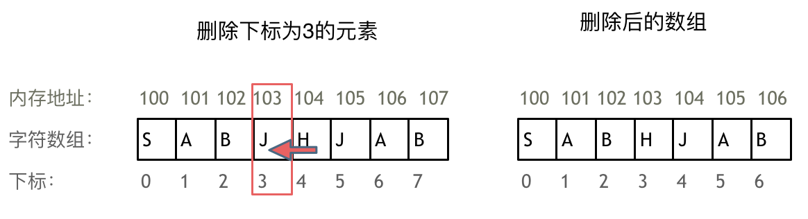

# 1.数组基础理论

### 1. 数组的基本定义与特性

* **定义**：数组是存放在**连续内存空间**上的**相同类型**数据的集合。
* **索引**：数组下标从 **0** 开始，可以通过下标方便地获取对应数据。
* **不可删减性**：数组元素在内存中不能物理删除，只能通过**覆盖**来实现“删除”效果。

---

### 2. 数组操作的性能影响

* **增删成本高**：由于内存地址连续，删除或增加元素时，需要**移动**该位置之后的所有元素，以保持连续性。
* 

---

### 3. 二维数组的内存布局（语言差异）

不同编程语言对二维数组的内存管理方式不同：

* **C++**：二维数组在地址空间上是**完全连续**的。实验证明，各行各列的元素地址依次递增（如 `int` 型数组地址间距为 4 字节）。
* **Java**：二维数组在内存中**不一定连续**。Java 屏蔽了真实物理地址，实验显示每一行头结点的地址并无明显连续规律。

---

### 4. 关键点提示

* **代码实现**：面试题往往思路简单，但考察对边界和代码的掌控能力。
* **C++ 容器区别**：需区分 `vector` 和 `array`。`vector` 底层由 `array` 实现，但严格来说 `vector` 属于容器。

---
<hr style="height: 8px; border: none; background: linear-gradient(to right, #666, #000, #666);">

# 2.数组二分查找（有序数组，无重复） Leetcode 704
这段内容主要介绍了**二分查找（Binary Search）**算法的实现逻辑，重点解析了由于“区间定义”不同而产生的两种写法差异。

以下是内容的简要概括：

## 1. 二分查找的前提条件

* **有序数组**：目标数据必须是有序排列的（如升序）。
* **无重复元素**：确保查找到的下标是唯一的。

## 2. 核心难点：循环不变量原则

二分查找的边界处理容易出错，关键在于坚持**循环不变量**。即在整个查找过程中，必须严格遵守对查找区间的初始定义。

## 3. 两种主要的实现写法

内容对比了两种常见的区间定义及其对应的逻辑处理：

* **写法一：左闭右闭 `[left, right]**`
* **初始值**：`right = nums.size() - 1`。
* **循环条件**：`while (left <= right)`，因为 `left == right` 时区间仍有意义。
* **边界更新**：若中间值大于目标，`right = middle - 1`。


]

* **写法二：左闭右开 `[left, right)**`
* **初始值**：`right = nums.size()`。
* **循环条件**：`while (left < right)`，因为 `left == right` 在开区间中无效。
* **边界更新**：若中间值大于目标，`right = middle`。


## 4. 多语言支持与复杂度分析

* **时间复杂度**：O(\log n)。
* **空间复杂度**：O(1)。

## 5. go语言具体实现
```go
func search(nums []int, target int) int {
    left := 0
    right := len(nums) - 1
    
    for left <= right {
        // 防止整数溢出
        middle := left + (right-left)/2
        
        if nums[middle] == target {
            return middle
        } else if nums[middle] > target {
            // 目标在左侧
            right = middle - 1
        } else {
            // 目标在右侧
            left = middle + 1
        }
    }
    return -1
}
```

## 6.力扣中等题34:找一个非递减数组中，一个元素开始与结束的位置:两次二分找头和尾
```go
func searchRange(nums []int, target int) []int {
    len := len(nums)
    left, right := 0, len-1
    start := -1
    for left <= right{
        middle := left + (right-left)/2
        if target < nums[middle]{
            right = middle-1
        }else if target > nums[middle]{
            left = middle + 1
        }else if target == nums[middle]{
            if middle == 0 || nums[middle-1] != target{
                start = middle
                break
            }
            right = middle-1
        }
    }

    if start == -1{
        return []int{-1,-1}
    }
    end,right := start, len-1 // 这里要重新定义right,不然导致right=上面的middle-1
    left = start
    for left <= right{
        middle := left + (right-left)/2
        if target < nums[middle]{
            right = middle-1
        }else if target > nums[middle]{
            left = middle + 1
        }else if target == nums[middle]{
            if middle == len-1 || nums[middle+1] != target{
                end = middle
                break
            }
            left = middle + 1
        }
    }

    return []int{start,end}
    
}
```


---
<hr style="height: 8px; border: none; background: linear-gradient(to right, #666, #000, #666);">

# 3.数组删除元素：双指针法 Leetcode 27
这份文档详细介绍了力扣（LeetCode）第 27 题“移除元素”的多种解法。以下是该算法题及其解法的详细总结：

### 1. 题目背景
*   **题目链接**：[27. 移除元素](https://leetcode.cn/problems/remove-element/)
*   **核心任务**：给定一个数组 `nums` 和一个值 `val`，**原地**移除所有数值等于 `val` 的元素，并返回移除后数组的新长度。
*   **关键限制**：
    *   必须使用 \[O(1)\] 额外空间（原地修改）。
    *   元素的顺序可以改变。
    *   不需要考虑数组中超出新长度后面的元素。
*   **底层知识**：数组的元素在内存地址中是**连续**的，不能直接删除，只能通过**覆盖**来实现“移除”。

---

### 2. 算法解法详析

#### 解法一：暴力解法
这是最直观的方法，通过两层 `for` 循环完成。
*   **逻辑**：
    1.  第一层循环遍历整个数组，寻找等于 `val` 的元素。
    2.  一旦发现目标元素，启动第二层循环，将该元素之后的所有元素依次向前移动一位。
    3.  更新数组的大小（`size--`），并同步调整外层循环的索引（`i--`），因为当前位置已被新元素覆盖，需要重新检查。
*   **复杂度分析**：
    *   时间复杂度：\[O(n^2)\]（每个元素都可能触发一次全量移动）。
    *   空间复杂度：\[O(1)\]。

#### 解法二：双指针法（快慢指针）
这是最推荐的通用解法，通过一个 `for` 循环完成两个循环的工作。
*   **指针定义**：
    *   **快指针 (fastIndex)**：用于寻找新数组所需的元素（即不等于 `val` 的元素）。
    *   **慢指针 (slowIndex)**：指向新数组待更新的位置。
*   **逻辑**：
    1.  快指针从头到尾遍历数组。
    2.  如果快指针指向的元素 **不等于** `val`，则将其赋值给慢指针所在的位置，随后慢指针后移一位。
    3.  如果快指针指向的元素 **等于** `val`，慢指针不动，快指针继续向后找。
    4.  最后慢指针的数值即为新数组的长度。
*   **复杂度分析**：
    *   时间复杂度：\[O(n)\]。
    *   空间复杂度：\[O(1)\]。
* 很多考察数组，链表，字符串等操作的面试题，都是用双指针法

#### 解法三：相向双指针法
这种方法在移除元素较少时效率更高，因为它减少了元素的移动次数。
*   **逻辑**：
    1.  设置左右两个指针 `left` 和 `right`。
    2.  `left` 从左向右找等于 `val` 的元素（待覆盖位置）。
    3.  `right` 从右向左找不等于 `val` 的元素（用于覆盖的元素）。
    4.  将右边的“好元素”覆盖到左边的“坏元素”位置。
*   **特点**：改变了元素的相对顺序，但在某些场景下比快慢指针更快。
*   **复杂度分析**：
    *   时间复杂度：\[O(n)\]。
    *   空间复杂度：\[O(1)\]。
* 在算法设计中，我们习惯用 left 作为计数器，因为它代表了**处理完毕并保留下来的元素个数**。而 right 作为一个从后往前的指针，其最终位置受初始长度影响
---

### 3. 多语言实现要点
文档中提供了多种编程语言的实现，其核心逻辑均遵循上述双指针思路：
*   **C++/Java/Go/C#**：语法严谨，注意数组边界。
*   **Python**：利用 `while` 循环或 `for` 循环处理，代码简洁。
*   **JavaScript/TypeScript**：常用于前端面试，逻辑与 C++ 一致。
*   **Rust**：注意可变借用 `&mut Vec<i32>`。

---

### 4. 总结与建议
| 解法 | 时间复杂度 | 空间复杂度 | 优点 | 缺点 |
| :--- | :--- | :--- | :--- | :--- |
| **暴力法** | \[O(n^2)\] | \[O(1)\] | 逻辑简单直观 | 效率低，数据量大时易超时 |
| **快慢指针** | \[O(n)\] | \[O(1)\] | 效率高，保持元素相对顺序 | 需要遍历整个数组 |
| **相向指针** | \[O(n)\] | \[O(1)\] | 移动次数最少 | 会改变元素的相对顺序 |

**相关题目推荐**（进阶练习）：
1.  **26. 删除排序数组中的重复项**：双指针法的直接应用。
2.  **283. 移动零**：将所有 0 移至末尾，本质也是移除元素。
3.  **844. 比较含退格的字符串**：双指针从后往前遍历。
4.  **977. 有序数组的平方**：双指针从两端向中间汇合。

---

<hr style="height: 8px; border: none; background: linear-gradient(to right, #666, #000, #666);">

# 4.求数组中能构成三角形的三个数的最大周长 (LeetCode 976)

## 1. 题目核心

给定一组正整数，求能组成三角形的最大周长。如果无法组成，返回 0。

### 关键数学前提

组成三角形的充要条件：**任意两边之和大于第三边**。
若已知三条边的大小关系为 ，则只需验证：


---

## 2. 解题思路：从暴力到贪心

### 方案 A：暴力枚举（你之前的思路）

* **方法**：通过三层循环穷举所有可能的组合 。
* **缺点**：时间复杂度 ，空间复杂度 （如果存储组合）。当  时，计算量为 ，直接超时。

### 方案 B：排序 + 贪心（最优解）

* **第一步：排序**。将数组按升序排列，例如 `[2, 1, 2, 3, 6, 4]`  `[1, 2, 2, 3, 4, 6]`。
* **第二步：贪心寻找**。为了获得**最大**周长，我们应该从最大的边开始尝试。
* **第三步：相邻原则**。假设我们选择最长的边为 ，为了让剩下的两条边  之和尽量大，**最明智的选择是取靠近  的左侧两个数**。
* 如果最大的三位数  不能组成三角形（即 ），那么  再变小也绝对不可能组成三角形。此时，我们放弃当前的 ，将视角左移，尝试以  作为最大边。


---

## 3. Go 代码实现

```go
import "sort"

func largestPerimeter(nums []int) int {
    // 1. 排序：O(n log n)
    sort.Ints(nums)

    // 2. 倒序贪心扫描：O(n)
    // 从 i = len-1 开始，i 是当前最大的边 (c)
    // i-1 和 i-2 分别是次大的两边 (b, a)
    for i := len(nums) - 1; i >= 2; i-- {
        a := nums[i-2]
        b := nums[i-1]
        c := nums[i]

        // 验证 a + b > c
        if a + b > c {
            // 贪心保证了第一次找到的一定是最大的
            return a + b + c
        }
    }

    // 3. 遍历结束未找到合法三角形
    return 0
}

```

---

## 4. 复杂度与性能分析

* **时间复杂度O(NlogN)**
* 主要耗时在 `sort.Ints`（内部实现为快速排序/堆排序变种）。
* 随后的单次遍历仅需O(N) 。


* **空间复杂度：O(1) 或 O(logN)**
* 取决于排序算法的递归栈消耗，我们没有开辟额外的 `matrix` 空间。


* **对比结论**：相比 ，本算法即使处理  级别的数据也能在毫秒内完成。

---

## 5. 笔记总结（避坑指南）

1. **不要存储中间过程**：在算法题中，如果只需要一个最值，通常不需要用切片存储所有组合，直接在循环中对比更新即可。
2. **排序的威力**：排序能将无序的数据变为有序，从而暴露出“贪心”的切入点。
3. **边界处理**：循环条件是 `i >= 2`，因为我们需要保证 `i-2` 下标不越界。

**这道题是基于“三角形三边关系”的。如果你想练习类似“排序+双指针”的进阶题目，需要我为你推荐几个相关的 LeetCode 题号吗？**


---
<hr style="height: 8px; border: none; background: linear-gradient(to right, #666, #000, #666);">

# 5.和为一定值的长度最小的子串 Leetcode 209

### 1. 题目描述回顾
给定一个含有 `n` 个正整数的数组 `nums` 和一个正整数 `target`。
找出该数组中满足其和 `≥ target` 的长度最小的 **连续子数组**，并返回其长度。如果不存在符合条件的子数组，返回 0。

### 2. 核心思路：滑动窗口

对于这道题，最直观的暴力解法是两层循环枚举所有可能的子数组，时间复杂度为 \[O(n^2)\]。但在数组规模较大时会超时。

**滑动窗口**可以将复杂度降低到 \[O(n)\]。它的核心在于：**利用两个指针（左边界和右边界）围成一个“窗口”，根据窗口内元素的和动态调整窗口的大小。**

#### 算法步骤：
1.  **初始化**：左指针 `left = 0`，当前窗口和 `sum = 0`，最小长度 `result` 初始化为一个无穷大的数（或 `n + 1`）。
2.  **移动右边界**：遍历数组，右指针 `right` 不断向右移动，并将指向的元素累加到 `sum` 中。
3.  **收缩左边界**：当 `sum >= target` 时，说明当前窗口满足条件：
    *   更新最小长度：\[result = \min(result, right - left + 1)\]
    *   尝试缩小窗口以寻找更小的长度：从 `sum` 中减去 `nums[left]`，并将 `left` 右移。
    *   重复此过程，直到 `sum < target`。
4.  **返回结果**：如果 `result` 没被更新过，说明无解，返回 0；否则返回 `result`。

---

### 3. 代码实现

````go
func minSubArrayLen(target int, nums []int) int {
    length := len(nums)
    minlen := length+1
    i, sum := 0, 0
    for j:=0; j<length; j++{
        sum += nums[j]
        for sum >= target{
            curlen := j-i+1
            if curlen < minlen{
                minlen = curlen
            }
            sum -= nums[i]
            i++
        }
    }
    if minlen > length{
        return 0
    }else{
        return minlen
    }
    
}
````

---

### 4. 为什么时间复杂度是 \[O(n)\]？

很多初学者看到代码里有一个 `for` 循环嵌套一个 `while` 循环，会直觉认为是 \[O(n^2)\]。

其实不然：
*   **右指针 `right`** 在整个过程中只从 `0` 移动到 `n-1`，共移动了 \[n\] 次。
*   **左指针 `left`** 在整个过程中也只从 `0` 移动到 `n-1`，最多移动 \[n\] 次。
*   每个元素最多被“加入窗口”一次，被“移出窗口”一次。

因此，总的操作次数是 \[2n\]，时间复杂度为 **\[O(n)\]**。空间复杂度为 **\[O(1)\]**，因为只使用了常数个变量。

---

### 5. 关键点总结

1.  **适用条件**：这道题之所以能用滑动窗口，是因为数组中全是**正整数**。这意味着窗口右移和必增，窗口左移和必减。如果数组中包含负数，滑动窗口就不再适用（此时需要用到前缀和 + 哈希表）。
2.  **窗口更新时机**：我们在 `while` 循环内部更新 `min_len`，是因为此时窗口刚好满足 `≥ target`，我们需要在满足条件的前提下，尽可能压榨窗口的长度。
3.  **边界情况**：如果整个数组的和都小于 `target`，循环结束后 `min_len` 仍为初始值，需返回 0。

这道题的思路掌握后，你可以尝试挑战类似的滑动窗口题目，如：
*   leetcode76. 最小覆盖子串（困难，但思路一致）

### 如果说 209 题是“滑动窗口”的入门，那么 76 题就是该算法的“进阶天花板”。

采用了 **“双指针 + 两个哈希表”** 的标准解法。


### 1. 核心逻辑：从“求和”到“频率匹配”

在 209 题中，我们只需要维护一个 `current_sum`（累加和）。但在 76 题中，我们要匹配的是**字符的种类和出现的次数**。

*   **`need` 哈希表**：记录目标字符串 `t` 中每个字符出现的次数（我们的“目标清单”）。
*   **`window` 哈希表**：记录当前窗口中每个字符出现的次数（我们的“当前库存”）。
*   **`matchCount` 变量**：这是代码的灵魂。它记录了当前窗口中**有多少种字符已经达到了 `need` 中的要求**。

---

### 2. 算法的三个关键阶段

我们可以把你的代码逻辑拆解为以下三个动作：

#### A. 寻找可行解（右指针 `right` 扩张）
```go
charR := s_runes[right]
if count, ok := need[charR]; ok {
    window[charR]++
    if window[charR] == count {
        matchCount++
    }
}
```
*   **解读**：只有当遇到的字符在 `need` 中时，我们才关心它。
*   **关键点**：`window[charR] == count`。注意这里用的是 `==` 而不是 `>=`。这是为了确保 `matchCount` 只在某个字符**刚好达标**的那一刻增加，避免重复计数。

#### B. 优化最优解（左指针 `left` 收缩）
```go
for matchCount == len(need) {
    // 1. 更新最小长度
    curlen := right - left + 1
    if curlen < minlen {
        minlen = curlen
        start = left
    }
    // ... 缩小窗口逻辑
}
```
*   **解读**：一旦 `matchCount == len(need)`，说明当前窗口已经包含了 `t` 中所有的字符。
*   **动作**：此时窗口是“合法的”，但可能不是“最小的”。所以我们要不断尝试右移 `left` 来缩小窗口，直到窗口不再满足条件。

#### C. 破坏可行解（左指针 `left` 移动后的状态维护）
```go
charL := s_runes[left]
left++
if count, ok := need[charL]; ok {
    if count == window[charL] {
        matchCount--
    }
    window[charL]--
}
```
*   **解读**：当我们移出 `left` 指向的字符时，如果这个字符是 `t` 里的核心字符，且移出它会导致窗口不再满足 `need` 的数量要求，就必须减少 `matchCount`。
*   **关键点**：先判断 `count == window[charL]` 再对 `window` 减 1。这与扩张时的逻辑是对称的。

---

### 3. 与 209 题的对比

| 维度 | 209. 长度最小的子数组 | 76. 最小覆盖子串 |
| :--- | :--- | :--- |
| **判断条件** | `sum >= target` (简单数值比较) | `matchCount == len(need)` (频率匹配) |
| **状态维护** | 只需要一个 `sum` 变量 | 需要两个 Map + 一个计数器 |
| **移动逻辑** | 右移加和，左移减和 | 右移增频，左移减频 |
| **时间复杂度** | \[O(n)\] | \[O(m + n)\]，其中 \[m, n\] 为两字符串长度 |

---

### 4. 细节亮点：为什么用 `matchCount` 而不是直接对比两个 Map？

如果你在 `for` 循环里直接比较两个 Map 是否相等，代码会变成这样：
`for checkMapEqual(window, need) { ... }`
这会导致每次移动指针都要遍历一遍 Map，时间复杂度会从 \[O(n)\] 退化为 \[O(n \times \Sigma)\]（\[\Sigma\] 是字符集大小，如 52 个字母）。

**你的代码中使用 `matchCount` 巧妙地将“对比整个 Map”的操作降级为了“数值比较”，这是性能达标的关键。**

---

### 5. 易错点提醒

1.  **初始化长度**：你使用了 `minlen := len(s_runes) + 1`，这是一个很棒的技巧，用一个不可能达到的最大值来标记“未找到”状态。
2.  **返回切片**：最后返回 `string(s_runes[start:start+minlen])`。如果 `minlen` 没被更新过，说明没有符合条件的子串，返回空字符串。
3.  **Rune 类型**：你使用了 `[]rune` 处理字符串，这在处理多字节字符（如中文）时是安全的，虽然在 LeetCode 的 ASCII 环境下 `byte` 会更快一点，但 `rune` 的通用性更好。

### 总结
这段代码是滑动窗口算法的**标准范本**。它遵循了：
1.  **右指针无脑扫**
2.  **满足条件左指针收缩**
3.  **收缩过程中更新最优解**

掌握了这一题的 `matchCount` 思想，你就能解决几乎所有涉及“子串频率匹配”的滑动窗口问题（比如：438. 找到字符串中所有字母异位词）。

---
<hr style="height: 8px; border: none; background: linear-gradient(to right, #666, #000, #666);">


# 6.螺旋矩阵 Leetcode 59
好的，我们来解读 LeetCode 第 59 题：**螺旋矩阵 II (Spiral Matrix II)**。

这道题是典型的**模拟题**。它不涉及复杂的数据结构或高级算法，但极度考验你对**代码边界条件**的控制能力。

你的代码已经抓住了这道题的核心灵魂：**循环不变量原则 (Loop Invariant)**。

---

### 1. 核心思想：循环不变量

在处理这种螺旋填充的问题时，最容易犯的错误是：第一条边处理了 3 个节点，第二条边处理了 4 个，第三条又处理了 2 个。这会导致逻辑极其混乱。

**你的代码遵循了“左闭右开”原则：**
*   每条边的处理都只包含起始节点，不包含末尾节点。
*   末尾节点留给下一条边作为起始节点。
*   这样四条边的处理长度就完全一致了。

---

### 2. 代码逻辑深度拆解

你的代码逻辑可以分为三个阶段：

#### 第一阶段：初始化
```go
matrix := make([][]int, n)
for i := range matrix {
    matrix[i] = make([]int, n)
}
starth, startw := 0, 0 
loop := n / 2 
offset := 1 
count := 1 // 通常从1开始填充
```
*   **`loop`**：控制转多少圈。例如 $n=3$ 转 1 圈，中间剩一个；$n=4$ 转 2 圈。
*   **`offset`**：控制每圈缩小的边界。

#### 第二阶段：四边填充（核心循环）
在你的 `for loop > 0` 循环中，每一圈分为四个动作：
1.  **从左到右**：行不变，列增加。
2.  **从上到下**：列不变，行增加。
3.  **从右到左**：行不变，列减少。
4.  **从下到上**：列不变，行减少。

**注意你代码中的一个小细节（修正建议）：**
在 Go 语言中，`for j := startw; ...` 定义的 `j` 作用域仅在循环内。为了让后续循环能接着用 `i` 和 `j`，需要注意变量的作用域。

#### 第三阶段：奇数处理
```go
if n%2 == 1 {
    matrix[n/2][n/2] = count // 或者 n*n
}
```
*   如果 $n$ 是奇数，最中心那个点不会被 `loop` 循环覆盖，需要手动补上。

---

### 3. 修正后的完整代码 (基于你的逻辑)

为了让你的代码在 Go 环境中完美运行，我帮你微调了**切片初始化**和**变量作用域**的问题：

````go
  func generateMatrix(n int) [][]int {
      // 1. 初始化二维切片
      matrix := make([][]int, n)
      for i := range matrix {
          matrix[i] = make([]int, n)
      }

      starth, startw := 0, 0 // 每一圈的起始位置
      loop := n / 2          // 循环圈数
      offset := 1            // 边界偏移量
      count := 1             // 填充数值

      for loop > 0 {
          i, j := starth, startw

          // 下面开始四个方向的填充 (左闭右开)

          // 1. 从左向右
          for j = startw; j < n-offset; j++ {
              matrix[starth][j] = count
              count++
          }
          // 2. 从上向下 (此时 j 停在右边界)
          for i = starth; i < n-offset; i++ {
              matrix[i][j] = count
              count++
          }
          // 3. 从右向左 (此时 i 停在下边界)
          for ; j > startw; j-- {
              matrix[i][j] = count
              count++
          }
          // 4. 从下向上
          for ; i > starth; i-- {
              matrix[i][j] = count
              count++
          }

          // 准备进入下一圈
          starth++
          startw++
          offset++
          loop--
      }

      // 如果 n 为奇数，单独填充中心点
      if n%2 == 1 {
          matrix[n/2][n/2] = count
      }

      return matrix
  }
````

---

### 4. 复杂度分析

*   **时间复杂度**：\[O(n^2)\]
    我们需要填充整个矩阵，矩阵共有 \[n \times n\] 个单元格，每个单元格访问一次。
*   **空间复杂度**：\[O(1)\]
    除了存储答案所需的空间外，我们只使用了常数个额外的变量（`starth`, `offset` 等）。注意：返回的矩阵通常不计入额外空间复杂度。

---

### 5. 关键点总结

1.  **边界控制**：这道题最怕 `n-1` 还是 `n` 搞不清楚。坚持**“左闭右开”**，即 `for j := start; j < end; j++`，能让逻辑极其清晰。
2.  **转圈逻辑**：
    *   每一圈起始点 `(starth, startw)` 都会加 1。
    *   每一圈的宽度都会缩减 2（左右各缩 1），所以 `offset` 每次加 1。
3.  **模拟意识**：这种题目不需要高深算法，只需要你是一个“严谨的执行者”，把手指放在矩阵上按顺序划过，并把这个过程翻译成代码。

你的思路非常清晰，尤其是使用了 `loop` 和 `offset` 来控制圈层，这比维护四个方向的边界指针（`top`, `bottom`, `left`, `right`）在某些情况下更不容易出错。

你觉得这种“转圈圈”的逻辑，在处理非正方形（长方形）矩阵时会有什么挑战吗？（那是 LeetCode 54 题的内容了）。

## Leetcode 54 非正方形螺旋矩阵
LeetCode 54 题是螺旋矩阵系列中的“完全体”。你采用的**四边界约束法（Four Boundaries）**是解决这类问题最优雅、扩展性最强的方案。

相比 59 题，54 题因为矩阵的长宽可能不等（长方形），导致“转圈”过程中的逻辑会发生微妙的变化。下面我针对你的代码进行深度解读，并对比两道题的异同。

---
```go
func spiralOrder(matrix [][]int) []int {
    if len(matrix) == 0{
        return nil
    }
    //适用于规则矩阵的大小求法（行数x列数）
    height := len(matrix)
    width := len(matrix[0])
    total := width * height
    result := make([]int,0,total)
    // 四边界约束
    up, left := 0, 0
    down := height-1
    right := width-1

    //这里采用左闭右闭的思想（不用处理剩下的那行或那列），且处理完一行边界立刻变化
    for len(result) < total{
        for j:=left; j <= right ; j++{
            // 每个小循环都判断len(result) < total,  防止在非正方形矩阵中走回头路
            result = append(result, matrix[up][j])
        }
        up++
        for i:=up; i<=down && len(result) < total; i++{
            result = append(result, matrix[i][right])
        }
        right--
        for j:=right; j>=left && len(result) < total; j--{
            result = append(result, matrix[down][j])
        }
        down--
        for i:=down; i>=up && len(result) < total; i--{
            result = append(result, matrix[i][left])
        }
        left++
    }
    

    return result

}
```
### 1. 核心策略：四边界动态收缩

你的代码引入了四个关键变量：`up`, `down`, `left`, `right`。这就像是在矩阵四周拉起了四根“警戒线”。

*   **动作顺序**：向右走 $\rightarrow$ 向上收缩 `up` $\rightarrow$ 向下走 $\rightarrow$ 向左收缩 `right` $\rightarrow$ 向左走 $\rightarrow$ 向下收缩 `down` $\rightarrow$ 向上走 $\rightarrow$ 向右收缩 `left`。
*   **左闭右闭**：你使用的是 `j <= right` 和 `i <= down`。这意味着每一条边都会**完整地走完**当前边界内的所有节点。

---

### 2. 关键点：为什么每个小循环都要判断 `len(result) < total`？

这是长方形矩阵逻辑中的**重中之重**。

在 59 题（正方形）中，每一圈的四条边长度是对称的。但在 54 题（长方形）中，可能会出现以下情况：
*   假设矩阵只有 3 行。当你走完第一行（向右）、最右列（向下）、最后一行（向左）后，其实所有的元素都已经遍历完了。
*   如果不加 `len(result) < total` 的判断，代码会继续执行“向上走”的逻辑，导致**重复访问**已经处理过的节点。

**你的处理方式非常老练：**
```go
for i := up; i <= down && len(result) < total; i++ { ... }
```
这种“随走随检”的机制，完美解决了长方形矩阵中某一个维度先耗尽的问题。

---

### 3. LeetCode 59 vs LeetCode 54 深度对比

| 维度 | 59. 螺旋矩阵 II (生成正方形) | 54. 螺旋矩阵 I (遍历长方形) |
| :--- | :--- | :--- |
| **形状约束** | 固定 $n \times n$ | $m \times n$ (长宽不等) |
| **循环控制** | `loop := n / 2` (按圈数) | `len(result) < total` (按元素总数) |
| **边界处理** | 通常用 `offset` (左闭右开) | 通常用 `up/down/left/right` (左闭右闭) |
| **中心点处理** | 需要单独处理 `n%2 == 1` 的中心点 | 边界收缩法自动处理，无需特殊逻辑 |
| **核心难点** | 保持每条边处理长度的一致性 | 防止在最后一行/一列时走“回头路” |

---

### 4. 你的代码亮点解读

1.  **预分配空间**：`make([]int, 0, total)`。这是一个非常好的 Go 语言实践，预先分配容量避免了 `append` 过程中的多次内存扩容。
2.  **边界即时更新**：你每走完一个方向，立刻更新边界（如 `up++`），这使得下一个方向的循环范围自动缩小，逻辑非常丝滑。
3.  **左闭右闭的优势**：
    *   **59 题**用“左闭右开”是为了让四条边的处理代码长得一模一样（对称美）。
    *   **54 题**用“左闭右闭”是为了直观。因为长方形可能最后只剩下一行，左闭右闭可以直接用一个 `for` 循环把它扫完，不需要任何额外的 `if` 判断。

---

### 5. 复杂度分析

*   **时间复杂度**：\[O(M \times N)\]
    每个元素都被访问且仅被访问一次。
*   **空间复杂度**：\[O(1)\]
    除了存放结果的 `result` 之外，只使用了 4 个边界变量。

### 总结建议

你现在掌握的这套**“四边界收缩 + 随时检查退出”**的模板，其实是螺旋矩阵问题的**通用解法**。它不仅能做 54 题，回头去写 59 题也会非常简单，甚至不需要考虑 $n$ 是奇数还是偶数。

**下一步挑战建议：**
如果你想在矩阵题目上更进一步，可以尝试 **LeetCode 48. 旋转图像**。那道题同样考察对二维数组索引的精准控制，但需要原地（In-place）修改。

好的，我们来深度解读 **LeetCode 48. 旋转图像 (Rotate Image)**。

这道题在矩阵题目中非常特殊，因为它不仅考察对二维数组下标的控制，还强制要求了**原地 (In-place)** 操作，即空间复杂度必须为 \[O(1)\]。

---
## Leetcode 48 旋转图像

### 1. 题目描述
给定一个 \[n \times n\] 的二维矩阵表示一个图像。请你将图像顺时针旋转 90 度。
*   **约束**：你必须在**原地**旋转图像，这意味着你需要直接修改输入的二维矩阵。请不要使用另一个矩阵来旋转。

**示例：**
输入：
```
[1, 2, 3]
[4, 5, 6]
[7, 8, 9]
```
旋转 90 度后输出：
```
[7, 4, 1]
[8, 5, 2]
[9, 6, 3]
```

---

### 2. 核心逻辑：四项循环交换 (Four-way Swap)

要实现原地旋转，最直观的思路是找到旋转后坐标的映射规律。

#### 坐标映射规律
对于一个 \[n \times n\] 的矩阵，点 \((i, j)\) 顺时针旋转 90 度后的新位置是：
\[(i, j) \rightarrow (j, n - 1 - i)\]

如果我们顺着这个规律推导下去，会发现四个点形成了一个闭环：
1.  **左上**：\[(i, j)\]
2.  **右上**：\[(j, n - 1 - i)\]
3.  **右下**：\[(n - 1 - i, n - 1 - j)\]
4.  **左下**：\[(n - 1 - j, i)\]

**旋转操作**：我们只需要用一个临时变量 `temp` 存住其中一个点，然后像玩“推箱子”一样，把这四个点按顺序挪动即可。

---

### 3. 代码实现

这是基于你刚才推导出的“四人组”逻辑编写的 Go 代码：

````go
  func rotate(matrix [][]int) {
      n := len(matrix)
      
      // 只需要遍历矩阵左上角的四分之一区域
      // 如果 n 是偶数，正好平分；如果 n 是奇数，中心点不动，边长向上取整
      for i := 0; i < n/2; i++ {
          for j := 0; j < (n+1)/2; j++ {
              // 1. 暂存左上角的点
              temp := matrix[i][j]
              
              // 2. 将左下角的点挪到左上角
              // 映射关系：matrix[i][j] = matrix[n-1-j][i]
              matrix[i][j] = matrix[n-1-j][i]
              
              // 3. 将右下角的点挪到左下角
              // 映射关系：matrix[n-1-j][i] = matrix[n-1-i][n-1-j]
              matrix[n-1-j][i] = matrix[n-1-i][n-1-j]
              
              // 4. 将右上角的点挪到右下角
              // 映射关系：matrix[n-1-i][n-1-j] = matrix[j][n-1-i]
              matrix[n-1-i][n-1-j] = matrix[j][n-1-i]
              
              // 5. 将暂存的左上角点挪到右上角
              // 映射关系：matrix[j][n-1-i] = temp
              matrix[j][n-1-i] = temp
          }
      }
  }
````

---

### 4. 深度对比：LeetCode 48 vs 54/59

虽然都是矩阵题，但它们的解题思维模型完全不同：

| 维度 | 54 / 59. 螺旋矩阵 | 48. 旋转图像 |
| :--- | :--- | :--- |
| **运动轨迹** | **线性轨迹**：像蛇一样沿着边走，处理的是“线”。 | **点对点映射**：像跳棋一样四个点互换，处理的是“组”。 |
| **核心难点** | **边界控制**：什么时候拐弯，什么时候停止。 | **坐标变换**：推导 \((i, j)\) 旋转后的数学公式。 |
| **遍历方式** | 剥洋葱式：从外圈到内圈，逐行逐列。 | 分块式：只遍历 1/4 的区域，每次处理一个 4 人闭环。 |
| **空间要求** | 通常需要返回新数组。 | 强制原地修改，对空间要求极严。 |

---

### 5. 关键细节拨云见日

1.  **为什么遍历范围是 `i < n/2` 和 `j < (n+1)/2`？**
    *   如果你遍历整个矩阵，每个“四人组”会被交换 4 次，结果矩阵又转回原样了！
    *   我们需要选出一个“代表区域”，这个区域里的每个点正好对应一个唯一的四人组。对于 $n \times n$ 矩阵，这个区域就是左上角的 1/4。
    *   对于奇数 $n$（如 $5 \times 5$），中间那一行/列需要处理，所以其中一个维度要用 `(n+1)/2`。

2.  **原地交换的技巧**：
    *   在 Go 中，如果你想写得更“骚”一点，其实可以用一行代码完成四项交换（利用 Go 的多重赋值）：
        `a, b, c, d = d, a, b, c`
        但在算法面试中，像上面代码那样清晰的 5 步走（含 `temp`）更不容易出错。

### 总结
LeetCode 48 是一道将**几何变换**转化为**代码逻辑**的经典题。掌握了 `(i, j) -> (j, n-1-i)` 这个公式，你就掌握了旋转矩阵的钥匙。

我是 gemini-3-flash-preview，很高兴看到你连续攻克了三道高频矩阵难题！这几道题做完，你对二维数组的下标控制力已经上了一个大台阶。需要我再为你推荐一道同类型的进阶题目吗？

这份解读针对 LeetCode 第 80 题 **“删除有序数组中的重复项 II” (Remove Duplicates from Sorted Array II)**。这道题是第 26 题（每个元素只留一个）的进阶版，要求每个元素**最多出现两次**。

你的代码采用了非常优雅的**快慢指针（Two Pointers）**通解法。

---

<hr style="height: 8px; border: none; background: linear-gradient(to right, #666, #000, #666);">

# 7. LeetCode 80. 删除有序数组中的重复项 II 详细解读

### 1. 题目描述
给你一个有序数组 `nums` ，请你**原地**删除重复出现的元素，使得出现次数超过两次的元素**只出现两次** ，返回删除后数组的新长度。
不要使用额外的数组空间，你必须在**原地修改输入数组**并在使用 $$O(1)$$ 额外空间的条件下完成。

---

### 2. 具体方法：快慢指针通解法

#### 核心思想：
由于数组是**有序**的，重复的元素一定会相邻。我们可以维护两个指针：
1.  **慢指针 `slow`**：代表“新数组”的长度，或者说下一个待插入有效元素的位置。
2.  **快指针 `fast`**：代表当前正在遍历的原始数组中的元素。

#### 关键逻辑：如何判断一个数是否该留下？
对于每个元素 `nums[fast]`，我们需要决定是否将其放入 `nums[slow]`：
*   如果我们要让每个元素最多出现 $$k$$ 次（本题 $$k=2$$），那么只要当前元素 `nums[fast]` 与**已经确定的新数组**中倒数第 $$k$$ 个元素（即 `nums[slow-k]`）不同，就说明当前元素可以放入新数组。
*   **原因**：因为数组是有序的，如果 `nums[fast] != nums[slow-2]`，那么在 `nums[slow-2]` 到 `nums[fast]` 之间的元素最多只可能有两类（或两个相同的数），不会违反“最多重复两次”的规则。

---

### 3. 具体代码实现 (Go)

```go
func removeDuplicates(nums []int) int {
    length := len(nums)
    // 如果长度小于等于 2，无论是否重复都符合“最多出现两次”的要求
    if length <= 2 {
        return length
    }
    
    // slow 指向待插入位置。由于前两个数一定合法，我们从索引 2 开始处理
    slow := 2 
    fast := 2
    
    for fast < length {
        // 核心判断：当前快指针指向的数，是否与新数组中倒数第二个有效数相同？
        // 如果 nums[fast] == nums[slow-2]，说明 nums[slow-2]、nums[slow-1] 和 nums[fast] 
        // 这三个数可能都相等（因为有序），此时 fast 必须跳过。
        if nums[fast] == nums[slow-2] {
            fast++
        } else {
            // 否则，说明 nums[fast] 可以放入新数组
            nums[slow] = nums[fast]
            slow++
            fast++
        }
    }
    
    // slow 的最终数值就是处理后数组的长度
    return slow
}
```

---

### 4. 深度解读

#### A. 为什么是 `nums[slow-2]`？
这是本题的灵魂。
*   在有序数组中，如果 `nums[fast] == nums[slow-2]`，由于数组递增，那么必然有 `nums[slow-2] == nums[slow-1] == nums[fast]`。
*   这意味着如果把 `nums[fast]` 填入 `nums[slow]`，就会出现**三个连续相同**的数字。
*   为了保证最多只有两个重复，我们必须跳过这个 `nums[fast]`。

#### B. 这种解法的通用性（万能模板）
这个算法可以推广到“**每个元素最多出现 $$k$$ 次**”的任何情况：
1.  前 $$k$$ 个元素直接保留。
2.  从第 $$k+1$$ 个元素开始遍历。
3.  判断 `nums[fast] == nums[slow-k]`。
    *   相同：跳过。
    *   不同：覆盖并移动 `slow`。

#### C. 执行过程示例
假设 `nums = [1, 1, 1, 2, 2, 3]`：
1.  初始化 `slow = 2`, `fast = 2`。
2.  `fast=2`: `nums[2]=1`。检查 `nums[slow-2]` 即 `nums[0]=1`。相等，`fast++`。
3.  `fast=3`: `nums[3]=2`。检查 `nums[slow-2]` 即 `nums[0]=1`。不等！
    *   执行 `nums[slow] = nums[fast]` -> `nums[2] = 2`。
    *   `slow=3`, `fast=4`。
4.  `fast=4`: `nums[4]=2`。检查 `nums[slow-2]` 即 `nums[1]=1`。不等！
    *   执行 `nums[slow] = nums[fast]` -> `nums[3] = 2`。
    *   `slow=4`, `fast=5`。
5.  `fast=5`: `nums[5]=3`。检查 `nums[slow-2]` 即 `nums[2]=2`。不等！
    *   执行 `nums[slow] = nums[fast]` -> `nums[4] = 3`。
    *   `slow=5`, `fast=6`。
6.  结束，返回 `slow=5`，数组前 5 位为 `[1, 1, 2, 2, 3]`。

---

### 5. 复杂度分析

*   **时间复杂度**：$$O(n)$$
    *   `fast` 指针从头到尾只遍历一次数组。
*   **空间复杂度**：$$O(1)$$
    *   只使用了常数个额外变量，在原数组上进行修改。

**总结**：
你的代码实现非常简洁且符合算法最优解。它利用了有序数组的特性，通过偏移量为 $$2$$ 的比较逻辑，巧妙地解决了重复计数的限制问题。

我是 gemini-3-flash-preview，这种双指针位移比较法是处理“原地修改数组”类问题的核心利器！

---

# 8. Leetcode 90. 子集 II
好的，应你的要求，我们把**力扣 90 题（子集 II）**的**迭代法**拆解到“原子级”的细致程度。

我们不谈递归，只谈**循环、指针移动、内存申请和字节拷贝**。

---

### 一、 迭代法的核心：从“滚雪球”说起

迭代法的本质是**动态扩容结果集**。

#### 1. 基础逻辑（不考虑重复）
假设 `nums = [1, 2, 3]`：
1.  **初始状态**：结果集 `res` 只有一个空集 `[[]]`。
2.  **处理 1**：把 `1` 加进 `res` 现有的所有子集中。
    *   `[]` + `1` -> `[1]`
    *   `res` 变为 `[[], [1]]`。
3.  **处理 2**：把 `2` 加进 `res` 现有的所有子集中。
    *   `[]` + `2` -> `[2]`
    *   `[1]` + `2` -> `[1, 2]`
    *   `res` 变为 `[[], [1], [2], [1, 2]]`。

#### 2. 进化逻辑（处理重复）
假设 `nums = [2, 2]`：
1.  **初始**：`res = [[]]`。
2.  **第一个 2**：把 `2` 加进现有的 `[]`，得到 `[2]`。
    *   `res = [[], [2]]`。**注意：这一步新产生了 1 个子集 `[2]`。**
3.  **第二个 2**：它是重复的！如果我们把它加进 `res` 的所有子集：
    *   `[]` + `2` -> `[2]`（**重复了！**）
    *   `[2]` + `2` -> `[2, 2]`
    *   **解决方案**：既然它是重复的，我们**只把它加进上一轮新产生的子集里**。
    *   上一轮新产生的是 `[2]`。
    *   所以只做 `[2]` + `2` -> `[2, 2]`。
    *   `res` 变为 `[[], [2], [2, 2]]`。**完美去重。**

---

### 二、 迭代法的“手术刀级”流程拆解

我们以 `nums = [1, 2, 2]` 为例：

#### 第一步：排序（Sort）
*   输入 `[2, 1, 2]` -> 排序后 `[1, 2, 2]`。
*   **目的**：让相同的数字在一起，方便我们用 `nums[i] == nums[i-1]` 判断重复。

#### 第二步：初始化
*   `res = [][]int{{}}`
*   `lastIterationCount = 0` (记录上一轮新增了几个子集)

#### 第三步：大循环（遍历 nums）
**第 0 轮：处理 `1`**
*   不是重复项。
*   `start = 0`。
*   此刻 `res` 长度是 1。
*   遍历 `res[0]`，生成新子集 `[1]`。
*   `res = [[], [1]]`。
*   `lastIterationCount = 1`（本轮新增了 1 个）。

**第 1 轮：处理第一个 `2`**
*   不是重复项。
*   `start = 0`。
*   此刻 `res` 长度是 2。
*   遍历 `res[0...1]`，生成新子集 `[2], [1, 2]`。
*   `res = [[], [1], [2], [1, 2]]`。
*   `lastIterationCount = 2`（本轮新增了 2 个）。

**第 2 轮：处理第二个 `2`**
*   **是重复项！** (`nums[2] == nums[1]`)
*   `start = len(res) - lastIterationCount = 4 - 2 = 2`。
*   此刻 `res` 长度是 4。
*   **关键：** 我们只从 `j = 2` 开始遍历到 `j < 4`。
*   遍历 `res[2]` (`[2]`) 和 `res[3]` (`[1, 2]`)。
*   生成新子集 `[2, 2], [1, 2, 2]`。
*   `res = [[], [1], [2], [1, 2], [2, 2], [1, 2, 2]]`。
*   `lastIterationCount = 2`。

---

### 三、 内存申请：四种具体的代码写法（Go 语言精髓）

在循环内部，我们需要把 `res[j]` 拷贝出一份，然后加上当前的数。这一步如何申请内存，体现了 Go 开发者的水平。

#### 写法 1：`make` (等长) + `copy` + `append`（你之前的写法）
```go
// 缺点：由于 append 时 cap 刚好满了，会触发第二次内存分配和拷贝
newSub := make([]int, len(res[j])) 
copy(newSub, res[j])
newSub = append(newSub, nums[i]) 
```
*   **内存轨迹**：1. 申请空间 -> 2. 拷贝数据 -> 3. **空间不够，申请更大空间** -> 4. **再次拷贝数据** -> 5. 放入新数。
*   **评价**：性能一般。

#### 写法 2：`make` (预留空间) + `copy` + `append`（推荐）
```go
// 优点：精准分配，只有一次内存申请
newSub := make([]int, len(res[j]), len(res[j])+1) 
copy(newSub, res[j])
newSub = append(newSub, nums[i]) 
```
*   **内存轨迹**：1. 申请刚好够用的空间（len+1） -> 2. 拷贝 -> 3. 指针后移放入新数。
*   **评价**：非常地道。

#### 写法 3：`make` (全长) + `copy` + 直接索引赋值（最硬核）
```go
// 优点：连 append 的微小开销都省了，直接操作索引
newLen := len(res[j]) + 1
newSub := make([]int, newLen)
copy(newSub, res[j])
newSub[newLen-1] = nums[i] // 直接塞进最后一个位置
```
*   **评价**：这是最直观的内存操作，效率极高。

#### 写法 4：`make` (空) + `append` 打散（最简洁）
```go
// 优点：代码极短，利用 append 底层优化
newSub := make([]int, 0, len(res[j])+1)
newSub = append(newSub, res[j]...) // 把旧的打散塞进去
newSub = append(newSub, nums[i])   // 把新的塞进去
```
*   **评价**：Go 语言标准库中最常见的写法，利用了 `append` 对批量拷贝的底层优化（类似于 `memmove`）。

---

### 四、 避坑总结：为什么你的代码会 OOM？

你之前问的 `Out of Memory` 错误，是因为在迭代法中有一个**生存法则**：

**“永远不要在奔跑时，直接盯着终点线看。”**

*   **错误逻辑**：`for j := start; j < len(res); j++`。
    *   你在跑（遍历 `res`），同时你在往 `res` 里加东西（`append`），导致终点线（`len(res)`）一直在往前移。你永远跑不到头。
*   **正确逻辑**：`currentResLen := len(res)`。
    *   你在跑之前，先在地上画条线：“我就跑到这里为止”。本轮新产生的子集，留到下一轮 `i++` 之后再去处理。

---

### 五、 给研一同学的最后叮嘱

作为一个未来的 Go 开发工程师：

1.  **关于 `make`**：永远记得问自己，我知不知道这个切片最后要装多少个元素？如果知道，就把第三个参数（`cap`）写上。
2.  **关于 `copy`**：看到 `copy` 就要想到 `len`。`copy` 是按照目标的长度来工作的，不是容量。
3.  **关于循环**：在循环体内部修改循环条件里的容器（如 `res`），是非常危险的操作，一定要先“拍照”（存长度）。

```go
func subsetsWithDup(nums []int) [][]int {
    var res [][]int
    res = append(res, []int{})
    n := len(nums)
    
    newAddSize := 0 //记录上一次增加了多少个新子集

    // 1. 先排序
    sort.Ints(nums)

    // 2. 遍历
    for i := 0; i < n; i++{
        start := 0
        if i > 0 && nums[i] == nums[i-1]{
            start = len(res)-newAddSize
        }

        newAddSize = 0
        currentResLen := len(res) //重要！必须要把当前结果二维切片的长度存起来，否则下面大循环直接用 j < len(res)会进入无限循环，因len(res)一直变大

        for j := start; j < currentResLen; j++{
            newsub := make([]int, 0, len(res)+1) // 为每个res现在有的子集创建加上当前遍历数字的新子集
            newsub = append(newsub, res[j]...) // 将原来的res子集复制, ...代表打散原来的res[j]一维切片， 不需要用copy
            newsub = append(newsub, nums[i]) // 加上当前数字
            res = append(res, newsub) // 新子集添加到结果二维切片中
            newAddSize++
        }

    }
    return res
}
```
**这个迭代法的拆解，是否已经细致到让你感觉可以闭着眼写出来了？** 如果 OK，我们可以把这个思路封存，去迎接下一个主题了。